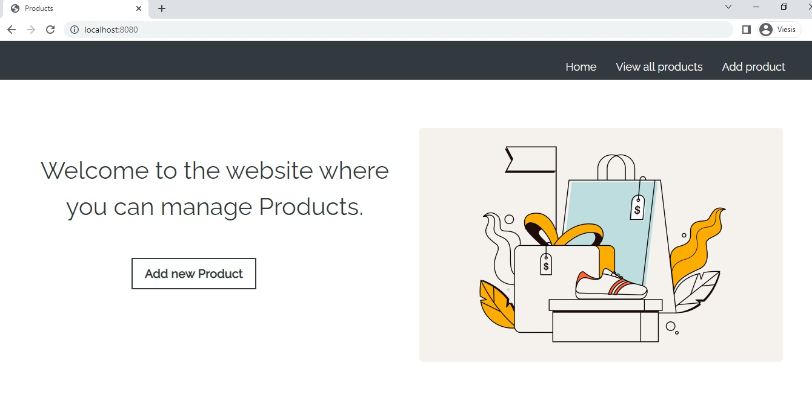
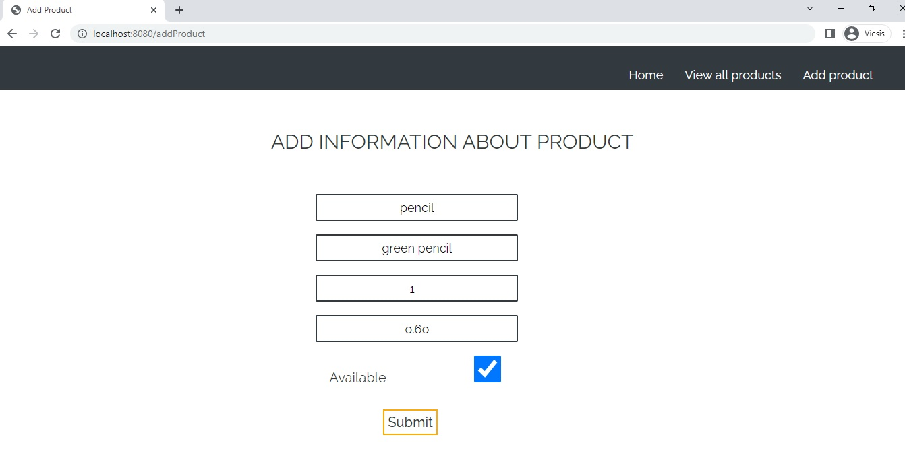
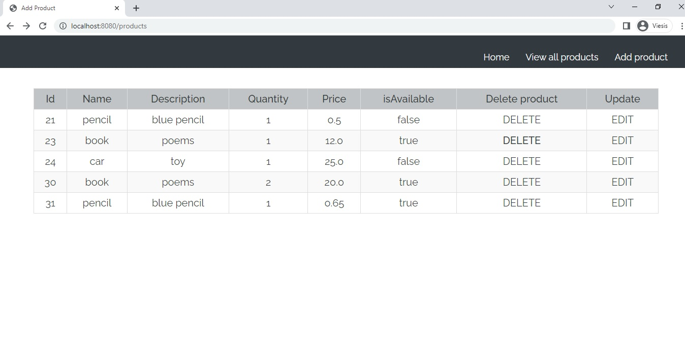

# productAssignmentSpringJDBC 

## Simple example project - Java Spring MVC web application for managing products using JDBC for database operations.


The application allows users to perform CRUD (Create, Read, Update, Delete) operations on products.
Technologies Used:
  - Java
  - Spring MVC
  - JDBC
  - MySQL

## Features:
- Home Page:


- Add Product: Users can add a new product by entering the product details in the "add Product" form and submitting it. 
http://localhost:8080/addProduct 



- View Products: Users can view all the products in the "products" page, which displays a list of products retrieved from the database using JDBC.
http://localhost:8080/products



- Update Product: Users can update the details of an existing product by clicking the "Edit" button next to the product in the "products" page
http://localhost:8080/edit


- Delete Product: Users can delete a product by clicking the "Delete" button next to the product in the "products" page.
http://localhost:8080/products


## Setup Instructions:
* Create a MySQL database with the name "spring_product".
* Import the project into your preferred Java IDE.
* Update the database connection details in the ProductRepository class's getConnection() method, including the username and password for your MySQL server.

```
private Connection getConnection() {
    String username = "YOUR_MYSQL_USERNAME";
    String password = "YOUR_MYSQL_PASSWORD";
    String database = "spring_product";

    String url = "jdbc:mysql://localhost:3306/" + database;

    Connection connection = null;

    try {
        connection = DriverManager.getConnection(url, username, password);
    } catch (SQLException e) {
        e.printStackTrace();
    }

    return connection;
}
```

* Build and run the project on a local server (e.g., Tomcat).
* Access the web application in your web browser using the URL provided by your local server (http://localhost:8080).


Note: This is a simple web application and does not include features such as authentication, authorization, or validation.
It is intended only for educational purposes.
